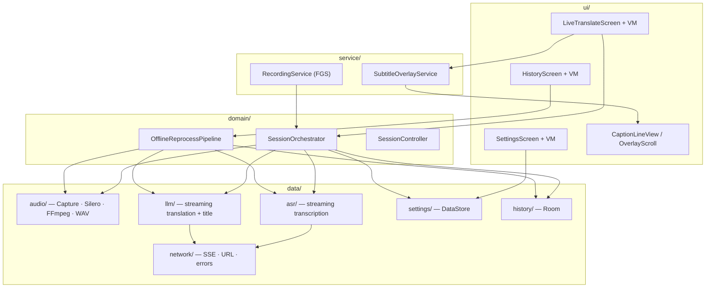
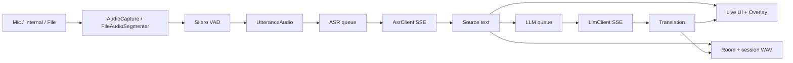
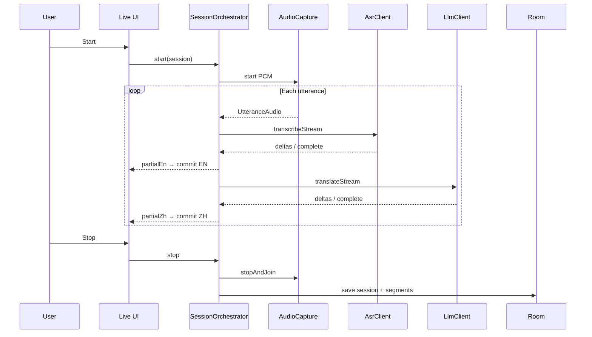
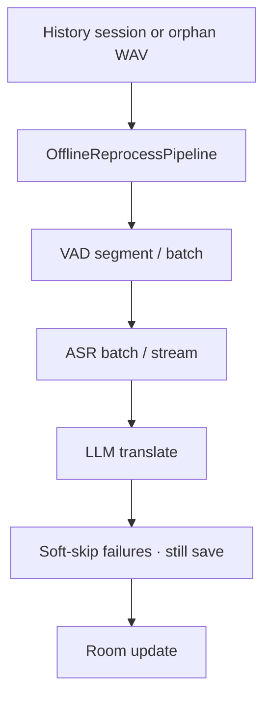
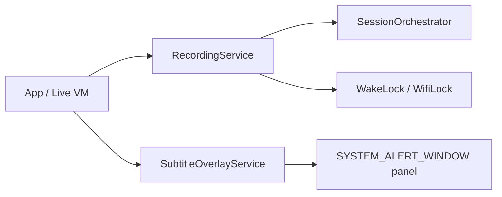

# Architecture

Engineering overview of **Live Translate** — package layout, runtime pipelines, and resilience. For install and setup, see the [README](../README.md).

## High-level layers



| Layer | Responsibility |
|-------|----------------|
| `ui/` | Jetpack Compose screens, ViewModels, floating caption widgets |
| `domain/` | Live + file session orchestration, offline reprocess, domain models |
| `data/` | Audio I/O, ASR/LLM clients, settings, Room history, network helpers |
| `service/` | Foreground recording, system overlay window |
| `di/` | Manual `AppContainer` wiring (no Hilt) |

---

## Package map

```
com.example.livetranslate/
├── ui/                 Compose + ViewModel (Live / History / Settings)
├── domain/             SessionOrchestrator, OfflineReprocessPipeline, models
├── data/
│   ├── audio/          AudioCapture · Silero · FFmpeg · session WAV · disk queue
│   ├── asr/            OpenAI transcriptions / chat-audio streaming
│   ├── llm/            Chat completions streaming + session title
│   ├── network/        SSE reader · URL resolve · latency probe
│   ├── settings/       DataStore · UserSettings · overlay enums
│   └── history/        Room DAO / repository / export
├── service/            RecordingService · SubtitleOverlayService
├── di/                 AppContainer
└── util/               Keep-alive, locale, share helpers
```

---

## Live session data flow



### Pipeline notes

1. **Sources** — Microphone; internal audio (API 29+, MediaProjection); local file via FFmpeg → mono 16 kHz PCM → Silero VAD with timeline offsets.
2. **VAD** — Silero DNN silence hangover + app-layer `maxUtteranceMs` force cut; cuts shorter than `minUtteranceMs` merge into the next speech run.
3. **Dual queues** — ASR and LLM are separate: the next utterance can start ASR while the previous one is still translating.
4. **ASR-first commit** — Source text is committed as soon as ASR finishes; translation may land later.
5. **Overflow** — When in-memory queues fill, utterances park on disk (`UtteranceDiskQueue` / `ParkedPcmStore`) instead of being dropped when possible.
6. **Stop** — Capture `stopAndJoin` before WAV finalize and MediaProjection release.



---

## Offline / history reprocess



- History: search, export, seek + scrub, **reprocess** ASR/translate.
- Cold start: orphan session WAV → reprocess / discard / later.
- Offline path can batch many VAD sentences per ASR request (`offlineVadBatchSize`).

---

## Services & keep-alive



| Piece | Role |
|-------|------|
| `RecordingService` | Foreground service for mic / mediaProjection capture |
| `SubtitleOverlayService` | Floating captions; lock/unlock via notification |
| Keep-alive helpers | WakeLock, WifiLock, battery-optimization hints |

---

## Default VAD parameters

Configurable in Settings; defaults:

| Parameter | Default | Role |
|-----------|---------|------|
| `silenceMs` | 260 | Silero silence hangover |
| `maxUtteranceMs` | 4500 | App-layer force cut |
| `minUtteranceMs` | 1500 | Short silence cuts merge into next speech |
| `sileroVadMode` | NORMAL | Silero threshold mode |
| Frame | 512 @ 16 kHz | ~32 ms (Silero fixed) |

---

## Resilience

| Mechanism | Behavior |
|-----------|----------|
| HTTP timeouts | connect 20s · read idle 45s · call 120s |
| Retries | Configurable (default 3), exponential backoff |
| Queues + disk overflow | Live utterances park offline instead of dropping |
| ASR-first | Source commits before translation finishes |
| Overlay ScrollLine | Holds incomplete empty ZH until LLM settle / fail; catch-up on backlog |
| Idle overlay | Clears floating text after **3s** without new caption |
| Stop path | `stopAndJoin` capture before WAV finalize / MediaProjection release |

---

## Permissions (engineering)

| Permission | Why |
|------------|-----|
| `RECORD_AUDIO` | Mic / internal capture |
| `FOREGROUND_SERVICE` + mic / mediaProjection | Background capture |
| `POST_NOTIFICATIONS` | Recording notification (API 33+) |
| `SYSTEM_ALERT_WINDOW` | Floating captions |
| `WAKE_LOCK` | Long sessions |

---

## Build / packaging notes

- **minSdk** 26 · **targetSdk** 34 · `applicationId` `com.example.livetranslate`
- ABI: `arm64-v8a` (CI). Add `x86` in `splits.abi` for local emulator builds if needed.
- Release defaults to debug keystore (sideload only)
- FFmpeg native libs increase APK size
- Room uses destructive migration on schema jump (can wipe history)
- API keys stored in plaintext DataStore; cleartext HTTP allowed for LAN gateways

---

## Related design docs

Historical design / plan notes live under [`docs/superpowers/`](../docs/superpowers/) (specs and implementation plans). Deferred product decisions: [`docs/DEFERRED_DECISIONS.md`](../docs/DEFERRED_DECISIONS.md).
