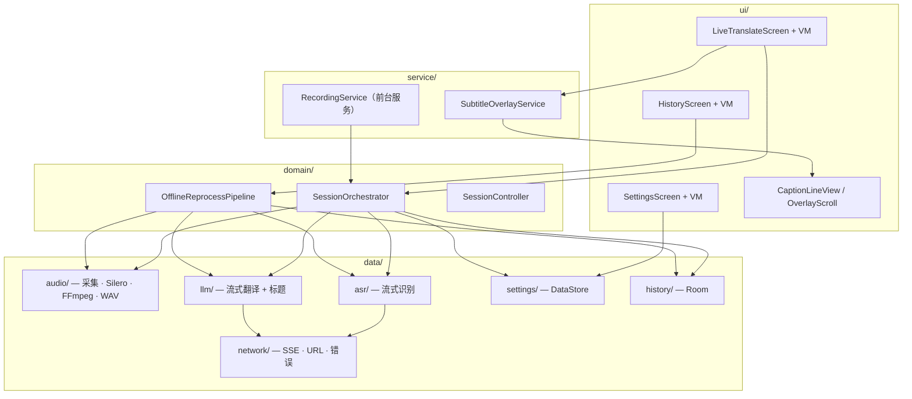
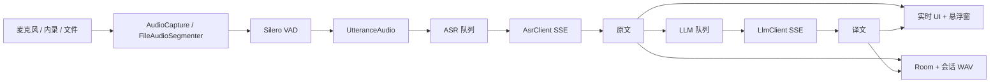
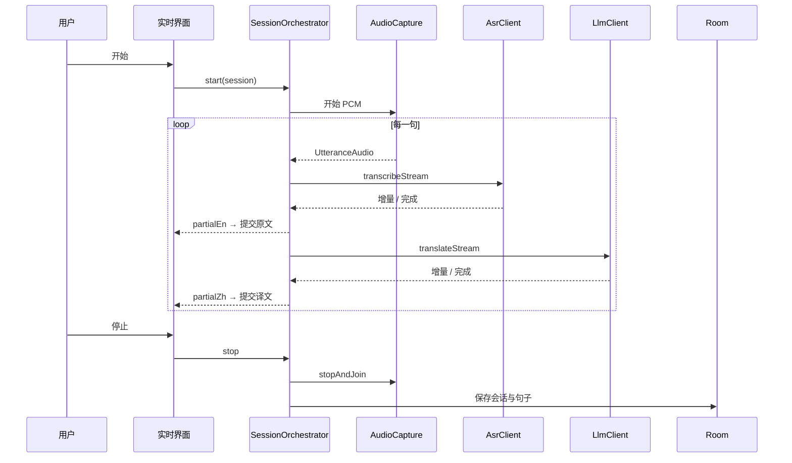
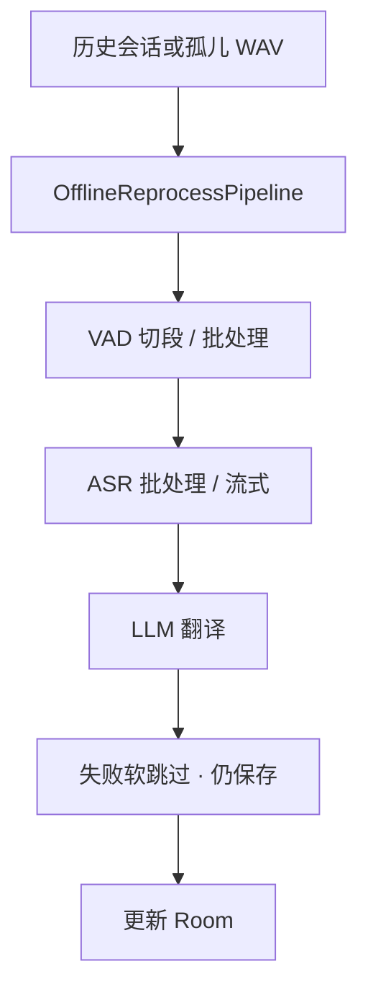
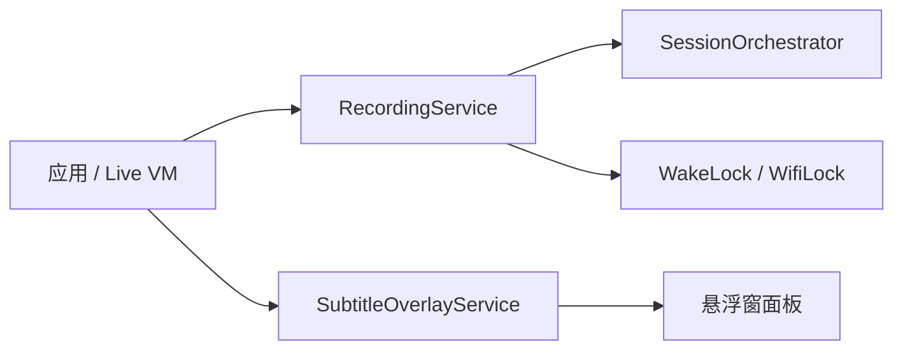

# 架构说明

**Live Translate** 的工程视角：包结构、运行时管线与容错机制。安装与配置请看 [README 中文版](../README.zh-CN.md)。

## 分层总览



| 层 | 职责 |
|----|------|
| `ui/` | Compose 界面、ViewModel、悬浮字幕控件 |
| `domain/` | 实时 / 文件会话编排、离线重跑、领域模型 |
| `data/` | 音频 I/O、ASR/LLM 客户端、设置、Room 历史、网络工具 |
| `service/` | 前台录音、系统悬浮窗 |
| `di/` | 手动 `AppContainer`（无 Hilt） |

---

## 包结构

```
com.example.livetranslate/
├── ui/                 Compose + ViewModel（实时 / 历史 / 设置）
├── domain/             SessionOrchestrator、OfflineReprocessPipeline、模型
├── data/
│   ├── audio/          AudioCapture · Silero · FFmpeg · 会话 WAV · 磁盘队列
│   ├── asr/            OpenAI transcriptions / chat-audio 流式
│   ├── llm/            Chat completions 流式 + 会话标题
│   ├── network/        SSE 解析 · URL 解析 · 延迟探测
│   ├── settings/       DataStore · UserSettings · 字幕枚举
│   └── history/        Room DAO / 仓库 / 导出
├── service/            RecordingService · SubtitleOverlayService
├── di/                 AppContainer
└── util/               保活、语言、分享等
```

---

## 实时会话数据流



### 管线要点

1. **音源** — 麦克风；内录（API 29+，MediaProjection）；本地文件经 FFmpeg → 单声道 16 kHz PCM → Silero VAD（带时间轴偏移）。
2. **VAD** — Silero DNN 静音挂起 + 应用层 `maxUtteranceMs` 强制切句；短于 `minUtteranceMs` 的切段并入下一句。
3. **双队列** — ASR 与 LLM 分离：上一句还在翻译时，下一句可先跑 ASR。
4. **ASR 优先落定** — 识别完成后先提交原文，译文可稍后到达。
5. **溢出** — 内存队列满时，语句尽量落盘排队（`UtteranceDiskQueue` / `ParkedPcmStore`），避免直接丢句。
6. **停止** — 先 `stopAndJoin` 采集，再收尾 WAV、释放 MediaProjection。



---

## 离线 / 历史重跑



- 历史：搜索、导出、进度跳转与 scrub、**重新识别 / 翻译**。
- 冷启动：发现孤儿会话 WAV → 重跑 / 丢弃 / 稍后。
- 离线路径可将多句 VAD 结果打包进一次 ASR 请求（`offlineVadBatchSize`）。

---

## 服务与保活



| 组件 | 作用 |
|------|------|
| `RecordingService` | 麦克风 / 内录的前台服务 |
| `SubtitleOverlayService` | 悬浮字幕；通知栏锁定 / 解锁拖动 |
| 保活工具 | WakeLock、WifiLock、电池优化提示 |

---

## 默认 VAD 参数

均可在设置中调整：

| 参数 | 默认 | 作用 |
|------|------|------|
| `silenceMs` | 260 | Silero 静音挂起 |
| `maxUtteranceMs` | 4500 | 应用层强制切句 |
| `minUtteranceMs` | 1500 | 过短静音切段并入下一句 |
| `sileroVadMode` | NORMAL | Silero 阈值模式 |
| 帧长 | 512 @ 16 kHz | 约 32 ms（Silero 固定） |

---

## 稳定性与容错

| 机制 | 行为 |
|------|------|
| HTTP 超时 | 连接 20s · 读空闲 45s · 整次调用 120s |
| 重试 | 可配置（默认 3），指数退避 |
| 队列 + 磁盘溢出 | 实时语句优先落盘排队，尽量不丢句 |
| ASR 优先 | 原文先落定，译文可稍后 |
| 悬浮 ScrollLine | 译文未就绪时 hold 空中文；积压时加速追赶 |
| 空闲悬浮 | **3 秒**无新字幕则清空浮层文字 |
| 停止路径 | 先 `stopAndJoin` 采集，再收尾 WAV / 释放 MediaProjection |

---

## 权限（工程侧）

| 权限 | 用途 |
|------|------|
| `RECORD_AUDIO` | 麦克风 / 内录 |
| `FOREGROUND_SERVICE` + mic / mediaProjection | 后台采集 |
| `POST_NOTIFICATIONS` | 录音通知（API 33+） |
| `SYSTEM_ALERT_WINDOW` | 悬浮字幕 |
| `WAKE_LOCK` | 长时间会话 |

---

## 构建与打包备注

- **minSdk** 26 · **targetSdk** 34 · `applicationId` `com.example.livetranslate`
- ABI 分包：`arm64-v8a`、`x86`（无 universal 胖包）
- Release 默认 debug 签名（仅旁加载）
- FFmpeg 原生库会增大 APK
- Room 跨 schema 使用破坏性迁移（可能清空历史）
- API Key 明文存 DataStore；为局域网网关允许 cleartext HTTP

---

## 相关设计文档

历史设计与实现计划见 [`docs/superpowers/`](../docs/superpowers/)。待定产品决策：[`docs/DEFERRED_DECISIONS.md`](../docs/DEFERRED_DECISIONS.md)。
